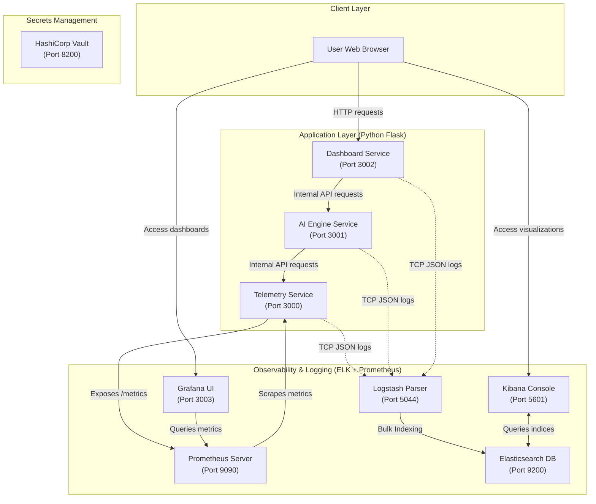

# VulcanAI: Cloud-Native DevOps Showcase

VulcanAI is a complete, production-grade DevOps showcase project designed to demonstrate the orchestration, monitoring, secrets management, logging, and deployment lifecycle of a modern microservices-based business application. 

This repository contains everything required to deploy the system locally using **Docker Compose** or **Kubernetes (Docker Desktop / Minikube)**, configure a **Jenkins CI/CD Pipeline**, manage infrastructure using **Terraform (AWS)**, collect metrics via **Prometheus & Grafana**, aggregate logs via **ELK Stack**, and secure configurations using **HashiCorp Vault**.

---

## 🏗️ System Architecture & Communication Flow

The application consists of three main Python Flask microservices that generate telemetry, evaluate health state via rule-based metrics, and render a dynamic real-time visualization portal.

### Architectural Diagram



### Inner-Service Communication Details

1. **Telemetry Service (Port 3000)**: Serves as the core resource monitor. It measures/simulates system CPU usage, memory utilization, and calculates a custom System Risk Index. It also exposes:
   * `/health`: Used by Kubernetes and Docker Compose for health checks.
   * `/metrics`: Serving Prometheus-compatible gauge values using the `prometheus-client` library.
2. **AI Service (Port 3001)**: Periodically pulls telemetry from the Telemetry Service. It applies rule-based logic to categorize status as `HEALTHY`, `WARNING`, or `CRITICAL` and generates human-readable recommended actions.
3. **Dashboard Service (Port 3002)**: Serves the front-end user portal. It queries the AI service internally and displays dynamic glassmorphic gauges, real-time mini-graphs (via Chart.js), system status warnings, and discovery health statuses of other services.

---

## 🛠️ Integrated DevOps Tools & Roles

| Tool | Purpose | Internal Working & Communication |
| :--- | :--- | :--- |
| **Docker & Compose** | Local orchestration | Packages applications into standardized layers. Enables rapid environment provisioning with a single command. |
| **Kubernetes (k8s)** | Production scaling & self-healing | Manages containers via pods, configures environment vars through `ConfigMaps`, and performs health checking via `liveness` and `readiness` HTTP probes. |
| **HashiCorp Vault** | Secrets Management | Operates as a central secret repository. Stored tokens and credentials are encrypted at rest and accessible via token authorization headers. |
| **Prometheus** | Metric Scraping | An active polling database. Scrapes `/metrics` from the Telemetry service every 5 seconds and stores them as time-series metrics. |
| **Grafana** | Visualization & Alerting | Connects to Prometheus as an HTTP datasource (`http://prometheus:9090`) to build charts, graphs, and operational dashboards. |
| **Elasticsearch** | Centralized Logging DB | A distributed NoSQL document store that indexes structured logs received from Logstash. |
| **Logstash** | Log Ingestion Pipe | Listens on raw TCP socket port `5044`. Parses streaming logs as JSON, enriches them with ingestion metadata, and pushes them to Elasticsearch. |
| **Kibana** | Log Visualizer | Accesses Elasticsearch API data on port `9200` to query indexes and render searchable timeline tables. |
| **Terraform** | Infrastructure as Code (IaC) | Declares and provisions Cloud compute resources (an AWS EC2 instance running Ubuntu 24.04) deterministically. |
| **Jenkins** | CI/CD automation | Runs pipeline builds (lints code, builds docker images, and deploys configurations to Kubernetes). |

---

## 🚀 Step-by-Step Getting Started Guide

### Prerequisites
Make sure you have the following installed on your machine:
* **Docker & Docker Desktop** (with Kubernetes enabled in Settings > Kubernetes)
* **kubectl** (Kubernetes CLI: `brew install kubernetes-cli`)
* **Terraform** (IaC CLI: `brew install terraform`)

---

### Option 1: Run with Docker Compose (Local Orchestration)

This launches all 9 services locally on your Docker daemon.

#### Step 1. Start the services:
Run the following command at the root folder of the project:
```bash
docker compose up -d --build
```

#### Step 2. Verify container statuses:
Verify that all 9 containers are running and healthy:
```bash
docker compose ps
```

#### Step 3. Access web interfaces:
* **VulcanAI Dashboard**: Open [http://localhost:3002](http://localhost:3002) in your browser.
* **Prometheus Targets**: Open [http://localhost:9090](http://localhost:9090).
* **Grafana (Metrics Panels)**: Open [http://localhost:3003](http://localhost:3003) (User: `admin` / Password: `admin`).
  > *Note*: When adding Prometheus as a data source in Grafana, use the internal URL `http://prometheus:9090` since they share the same Docker network.
* **HashiCorp Vault**: Open [http://localhost:8200](http://localhost:8200) (Use token: `root`).
* **Kibana (ELK logs)**: Open [http://localhost:5601](http://localhost:5601).

#### Step 4. Tear down the local deployment:
To stop and clean up all Docker Compose resources:
```bash
docker compose down -v
```

---

### Option 2: Deploy to Kubernetes (Local Docker Desktop Cluster)

This deploys the microservices stack on your local Kubernetes context.

#### Step 1. Set the correct image tags:
Since the Kubernetes manifests use local images, tag the locally built Docker images so that Kubernetes can find them without trying to pull from Docker Hub:
```bash
docker tag vulcan-ai-telemetry-service:latest telemetry-services:latest
docker tag vulcan-ai-ai-service:latest ai-service:latest
docker tag vulcan-ai-dashboard-service:latest dashboard-service:latest
```

#### Step 2. Deploy manifests to your cluster:
Run the deployment command:
```bash
kubectl apply -f kubernetes/
```

#### Step 3. Check status:
Ensure all Pods are in the `Running` state and the `READY` column shows `1/1`:
```bash
kubectl get pods,svc
```

#### Step 4. Expose the Dashboard Service to your browser:
Set up a port-forward to map your local port `3002` to the Kubernetes dashboard service:
```bash
kubectl port-forward svc/dashboard-service 3002:3002
```
Now, navigate to: [http://localhost:3002](http://localhost:3002) to view the live dashboard running inside Kubernetes!

#### Step 5. Clean up Kubernetes deployment:
Remove all deployed resources:
```bash
kubectl delete -f kubernetes/
```

---

### Option 3: Provision AWS Cloud Infrastructure (Terraform)

This provisions a `t3.medium` EC2 server running Ubuntu 24.04 in AWS.

#### Step 1. Initialize Terraform:
Navigate to the Terraform directory and initialize AWS plugins:
```bash
cd terraform
terraform init
```

#### Step 2. Run plan (Syntax and verification):
Examine the changes that Terraform will apply to your AWS account:
```bash
terraform plan
```

#### Step 3. Apply the plan:
Build the EC2 instance (this requires configured AWS environment keys):
```bash
terraform apply -auto-approve
```
*The public IP of the newly provisioned instance will be printed to your console.*

#### Step 4. Destroy resources:
To clean up and terminate the provisioned AWS resources:
```bash
terraform destroy -auto-approve
```

---

## 🪵 Testing Log aggregation (ELK Pipeline)

To showcase log processing through the Logstash -> Elasticsearch pipeline:

1. **Send a mock JSON log** to the Logstash listener:
   ```bash
   echo '{"service": "telemetry-service", "status": "critical", "cpu_usage": 98.4, "message": "Emergency restart trigger"}' | nc localhost 5044
   ```
2. **Verify Elasticsearch indexing**:
   Query the index search endpoint to verify the JSON data is successfully stored:
   ```bash
   curl http://localhost:9200/vulcan-logs-*/_search?pretty
   ```
3. **Configure Kibana Visualization**:
   * Open [http://localhost:5601](http://localhost:5601).
   * Navigate to **Analytics** > **Discover**.
   * Click **Create data view** (Index Pattern).
   * Enter index pattern `vulcan-logs-*`, select `@timestamp` as the time field, and save.
   * View and query your logs dynamically.

---

## 💾 Disaster Recovery (Backup & Restore)

We have provided recovery scripts to preserve state in the event of an outage.

* **To Backup Cluster State**:
  Run `./backup.sh` from the project root. This dumps all active resource statuses to `backup.txt` and packages configuration files into a compressed `kubernetes-config-backup.tar.gz` archive.
* **To Restore Cluster State**:
  Run `./restore.sh` to redeploy configuration manifests directly from the `kubernetes/` folder into your cluster context.